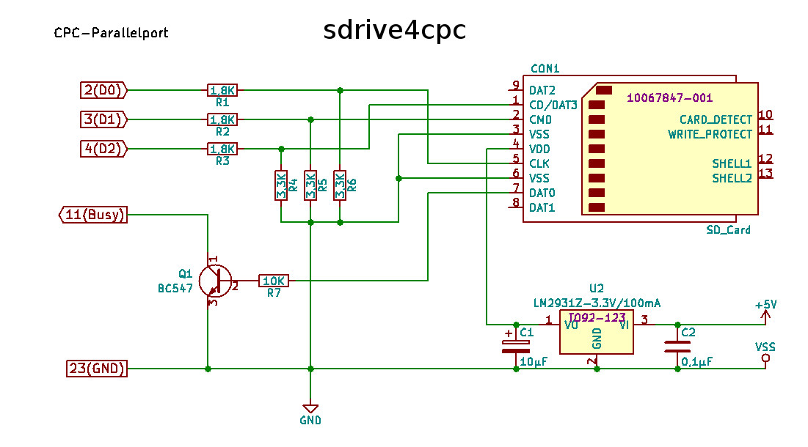

# SDrive for CPC

**sdrive4cpc** is a Tool for Amstrad(Schneider)-CPC computers to access
to a **SD-Card** connected to the *parallel port* of the **CPC**.
It is in early development state and can now write *DSK-Images*
stored on SD back to *real disc*, and create images from disc.
Only standard formatted discs(40 tracks, 9 sectors/track, 512 bytes/sector)
are supported yet, some copy protection may fail.

There is an evil bug on writing to SD-Card, which destroys the data sometimes, i didn't found yet. **Please be aware to backup your data!**

## Wiring:

- For output pins 2-4 to SD-Card use a simple voltage divider with
resistors, e. g. 1.8K/3.3K(GND).
- For input pin 11 use a NPN-transistor(BC547) collector to pin 11,
emitter to GND and base over 10K resistor to SD-Card(7),
because there is an internal pullup to 5V! This will invert the
logic level, but it is inverted by software again.
- For power supply you will need a 3.3V source to the SD-Card pin 4(VDD).
(or a voltage regulator and so on...)

(c) 2019 by KBr
